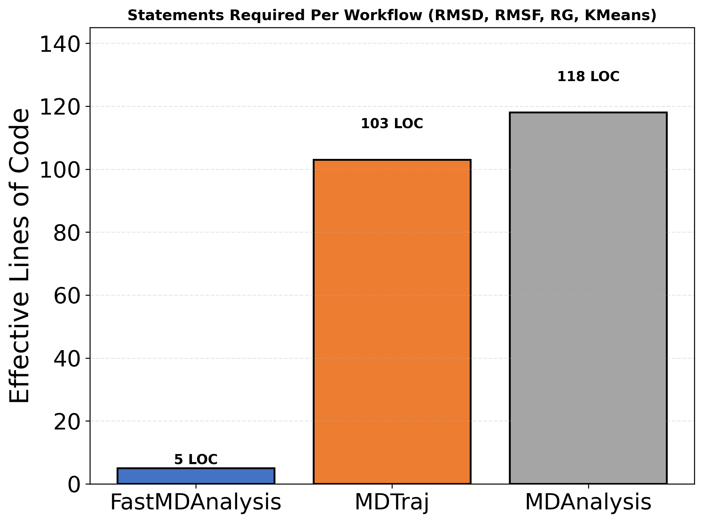
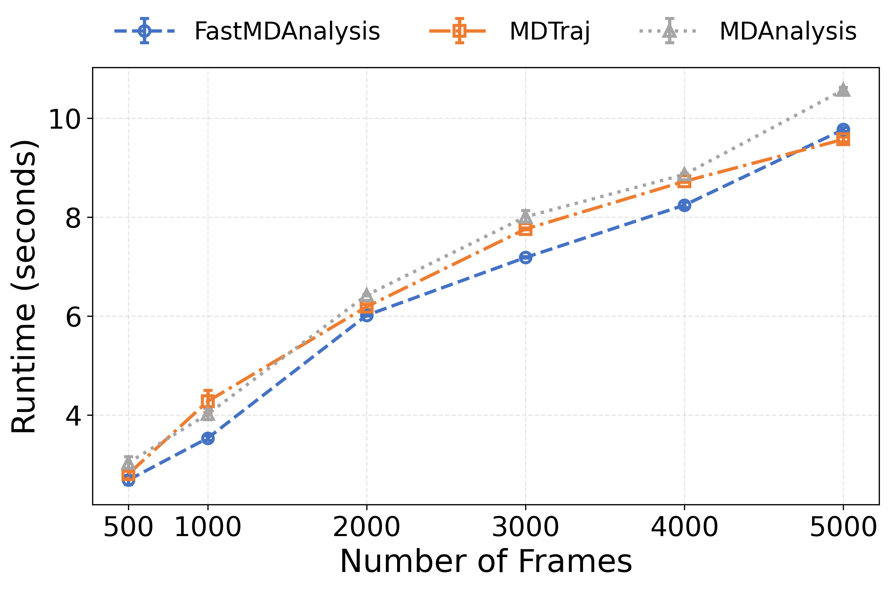
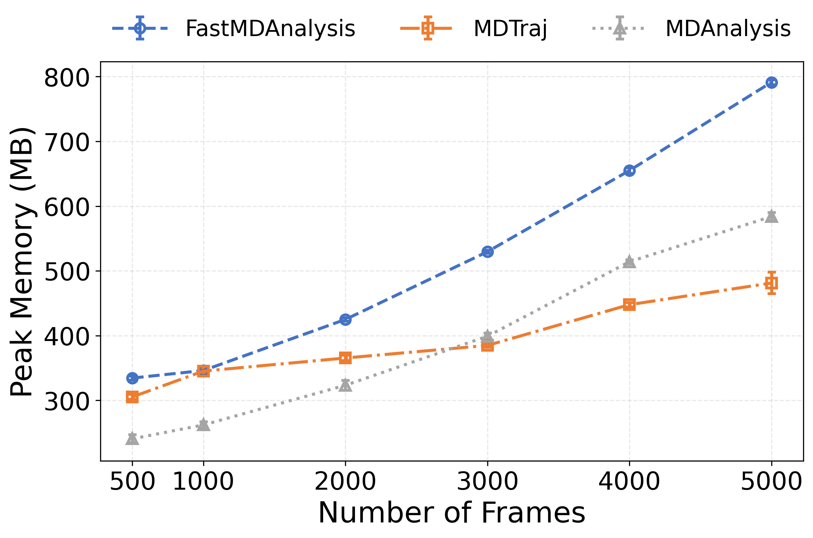

# FastMDAnalysis Benchmark Suite
This benchmark suite compares FastMDAnalysis against MDTraj and MDAnalysis for performance and workflow complexity.


## Reproducing JCC Submission Results

### Step 1: Get the Benchmark Code
Create and activate virtual environment
```bash
conda create -n fastmda_benchmark_env python=3.9
conda activate fastmda_benchmark_env
```
```bash
git clone -b benchmark https://github.com/aai-research-lab/FastMDAnalysis.git
```
```bash
cd FastMDAnalysis
```

### Step 2: Install Dependencies
```bash
pip install fastmdanalysis mdtraj MDAnalysis numpy scipy scikit-learn matplotlib psutil
```

### Step 3: Download and Prepare Data
- Download ubiquitin data from Zenodo https://zenodo.org/records/7792288
- Place files in Ubiquitin/ directory with renamed files:
  - Trajectory: Ubiquitin/ubiquitin.dcd (originally Q99.dcd)
  - Topology: Ubiquitin/ubiquitin.pdb (originally topology.pdb)
 

### Step 4: Run Benchmarks

Navigate to data directory
```bash
cd Ubiquitin
```
Run performance scaling benchmark
```bash
python ../scripts/benchmark_scaling.py --frames 500 1000 2000 3000 4000 5000 --iterations 5 --keep-artifacts 5000
```
Generate scaling plots
```bash
python ../scripts/benchmark_plot.py
```
Analyze code complexity
```bash
python ../scripts/benchmark_loc.py
```

### Output Files
After running the benchmarks, you will find:

- `benchmark_output/scaling_metrics.json` - Raw performance data

- `benchmark_output/combined_runtime.png` - Runtime scaling plot

- `benchmark_output/combined_memory.png` - Memory scaling plot

- `benchmark_output/benchmark_loc.png` - LOC comparison

- `benchmark_output/*_artifacts/` - Analysis outputs for 5000 frames


#### Code Complexity


#### Runtime Scaling


#### Memory Scaling  



## Benchmark Details

### Performance Scaling
Measures **runtime and peak memory usage** across 500-5000 frames with 5 iterations per data point. Compares:
FastMDAnalysis (blue), MDTraj (orange) and MDAnalysis (gray).

**Analyses Performed.**
All libraries execute identical workflows:

- RMSD calculation (aligned to first frame)
- RMSF per atom
- Radius of gyration time series
- K-means clustering (k=3) on Cartesian coordinates

### Workflow Complexity
Lines of Code (LOC) analysis counts meaningful statements required to implement equivalent analysis workflows in each library.

### Verification
Successful reproduction will generate all output files with performance characteristics matching those reported in the JCC submission.


